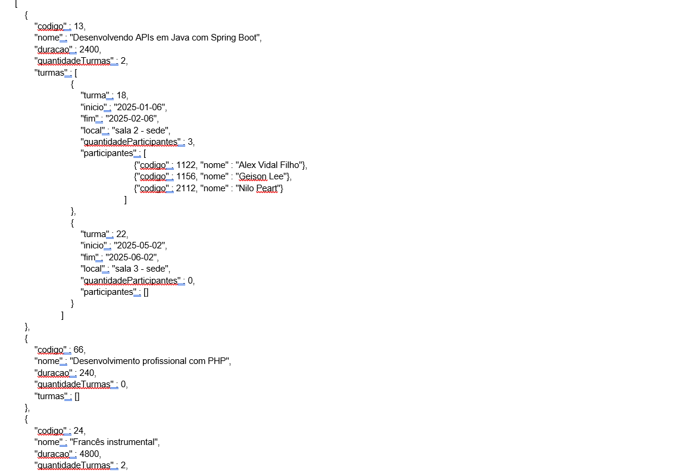

# Desafio Técnico Turmas
*Este projeto foi construído seguindo os requisitos solicitados pelo desafio.*

# Requisitos Técnicos
Prova de API REST usando Java / Spring

Contexto: 
    Controlar treinamentos dos funcionários.
Requisitos e regras de negócio: 
    Cadastro (inclusão, alteração, exclusão e listagem) de cursos. Um curso tem nome, descrição (resumo do conteúdo do curso) e duração (valor inteiro que representa a quantidade de minutos do curso. Exemplo: 90 indica que o curso dura 1 hora e meia).
    Cadastro de funcionários (nesse caso inclusão, alteração e busca por funcionários de acordo com o seu status). Um funcionário tem nome, CPF, data de nascimento, nome do cargo, data de admissão na empresa. Um funcionário não pode ser apagado, mas apenas marcado como inativo.
    Cadastro de turmas de treinamento (inclusão, alteração, exclusão de turmas, busca de turmas por curso, inclusão, exclusão e listagem de participantes). Entende-se por turma a aplicação de um curso por um determinado período (ver campos Inicio e Fim) para um grupo específico de funcionários (ver tabela TurmaParticipante). Um funcionário pode ter participado de vários cursos - isso implica que ele fez parte de várias turmas. Um curso pode ter várias turmas (ser oferecido em várias datas para vários grupos de funcionários). Uma turma tem data de ínicio, data de fim, local do treinamento e uma lista de participantes e está atrelada a um único curso.
    Para poder apagar um curso, deve ser verificada a existência de suas turmas. Caso exista pelo menos uma turma, o curso será mantido no banco de dados como inativo. Cursos inativos não retornam em consultas, a menos que isso seja solicitado em algum endpoint. Deve ser criado um parâmetro extra no endpoint de apagar curso, chamado "force", para remover não só o curso, mas todas as suas turmas, removendo os seus participantes. Considerar que o banco não tem deleção em cascata aqui e implementar a remoção dos registros em java, de maneira transacional.
    Não se pode mudar o curso de uma turma depois que já foi criada. Os demais campos podem ser alterados normalmente.
    Não se pode alterar um participante de uma turma. Mas é possível incluir participantes ou removê-los.
    A listagem de cursos deve trazer o nome, a duração, uma coluna informando o status (se o curso está ativo ou inativo), a quantidade de turma que existem.
    Já a busca de turmas é um endpoint que recebe como parâmetro o código do curso e é feito um filtro de todas as turmas daquela curso, ordenadas pela data de início e data de fim. Cada turma retornada deve informar a quantidade de funcionários da turma. 
    A busca por funcionários recebe um parâmetro que indica se deve trazer só ativos, só inativos ou ambos. O retorno deve ser ordenado por nome da pessoa. O parâmetro de filtro é opcional e, se omito, traz todos. Mas, se fornecido, deve indicar 0 para inativos ou 1 para ativos.
   Implementar um endpoint que, dado um código de funcionário, o exclua de todas as turmas futuras. A ideia é utilizar o serviço quando um funcionário for desligado da empresa.
    Criar um endpoint que traga um detalhamento de todas as turmas cujas respectivas datas de início estejam dentro de um período estipulado no filtro, recebido por parâmetro. Esse filtro deve passar uma data inicial e uma final e a data de início da turma deve estar nesse intervalo (usar between na busca ou algo similar). Ordenar alfabeticamente pelo nome do curso. A consulta deve trazer um resultado conforme o Json de exemplo abaixo:

Mesmo quando uma turma não tenha participantes, a mesma deve aparecer no retorno da busca. O mesmo vale para um curso que não tenha turmas.
        
            
O exercício consiste em criar os endpoints para atender a todas as operações citadas nos requisitos, provendo webservices no padrão REST, usando Java e Spring Boot. 
Seguir as boas práticas para uma API RESTFul (https://aws.amazon.com/pt/what-is/restful-api/).
Dar preferência ao uso de path parameters (https://www.baeldung.com/spring-requestparam-vs-pathvariable). 
NÃO deve ser utilizado nenhum mecanismo de ORM / geração automática de consultas, como JPA ou Hibernate. Todas as consultas devem ser escritas manualmente em SQL. Utilizar JDBC.* Pode ser utilizada alguma biblioteca externa que ajude na gestão do JDBC, como Apache DB Utils (https://commons.apache.org/proper/commons-dbutils/) ou similar, desde que a escrita dos SQLs seja feita pelo programador. Todas as operações que envolvam alteração de dados no banco devem ser transacionais.
Todos os endpoints devem gerar log usando log4j e registrar como INFO quando o endpoint foi chamado. O log deve informar "O serviço <serviço> foi chamado". Exemplo: O serviço de inclusão de participante em uma turma foi chamado". Também deve ter um log de nível DEBUG que exiba o SQL gerado pelo sistema.
Fica a critério do programador o uso de connection pool (Hikari, por exemplo - https://github.com/brettwooldridge/HikariCP).
Utilizar java 11 ou superior. 
O banco de dados pode ser qualquer um, desde que seja relacional. Exemplos (SQL Server, Oracle, MySQL, PostgreSQL, entre outros).
A aplicação deve ter separação de responsabilidades: classes separadas para receber a requisição REST (controller), para processar as regras de negócio, para acesso a banco de dados e objetos de transporte entre essas camadas.
Todos os endpoints devem validar se foi recebido no cabeçalho http chamado Authorization a string "Bearer token_exercicio_rest". Caso não seja encontrado esse cabeçalho na requisição ou o valor do token esteja diferente, o serviço deve retornar http 403.

# Estrutura das tabelas que criei:

CREATE TABLE usuario_acesso(
	id BIGSERIAL PRIMARY KEY NOT NULL,
	usuario_id_fk BIGINT NOT NULL,
	role_id_fk BIGINT NOT NULL,
	CONSTRAINT usuario_id FOREIGN KEY(usuario_id_fk) REFERENCES users(id),
	CONSTRAINT role_id FOREIGN KEY (role_id_fk) REFERENCES roles(id)
);

CREATE TABLE roles (
	id BIGINT PRIMARY KEY NOT NULL,
	role_desc VARCHAR(100) NOT NULL
); 

CREATE TABLE users(
	id BIGSERIAL PRIMARY KEY NOT NULL,
	login VARCHAR(55) NOT NULL,
	senha VARCHAR(200) NOT NULL,
	funcionario_id_fk BIGINT NOT NULL,
	CONSTRAINT funcionario_fk FOREIGN KEY(funcionario_id_fk) REFERENCES funcionario(codigo_funcionario)
);

CREATE TABLE curso (
    codigo_curso BIGSERIAL PRIMARY KEY NOT NULL,
    nome VARCHAR (100) NOT NULL,
    descricao VARCHAR(4000) NOT NULL,
    duracao INT NOT NULL,
	is_ativo VARCHAR(5) NOT NULL
);

CREATE TABLE funcionario (
    codigo_funcionario BIGSERIAL PRIMARY KEY NOT NULL,
    nome VARCHAR(200) NOT NULL,
    cpf CHAR(11) NOT NULL,
    dt_nascimento DATE NOT NULL,
    cargo VARCHAR(200) NOT NULL,
    dt_admissao DATE NOT NULL,
    is_ativo VARCHAR(5) NOT NULL
);

CREATE TABLE turma (
    codigo_turma BIGSERIAL PRIMARY KEY NOT NULL,
    dt_inicio DATE NOT NULL,
    dt_fim DATE NOT NULL,
    local VARCHAR(200),
    curso_id_fk BIGINT NOT NULL,
    CONSTRAINT fk_curso FOREIGN KEY(curso_id_fk) REFERENCES curso(codigo_curso)
);

CREATE TABLE turma_participante (
    codigo_turma_participante BIGSERIAL PRIMARY KEY NOT NULL,
    turma_id_fk BIGINT NOT NULL,
    funcionario_id_fk BIGINT NOT NULL,
    CONSTRAINT fk_turma FOREIGN KEY(turma_id_fk) REFERENCES turma(codigo_turma),
    CONSTRAINT fk_funcionario FOREIGN KEY(funcionario_id_fk) REFERENCES funcionario(codigo_funcionario)
);

